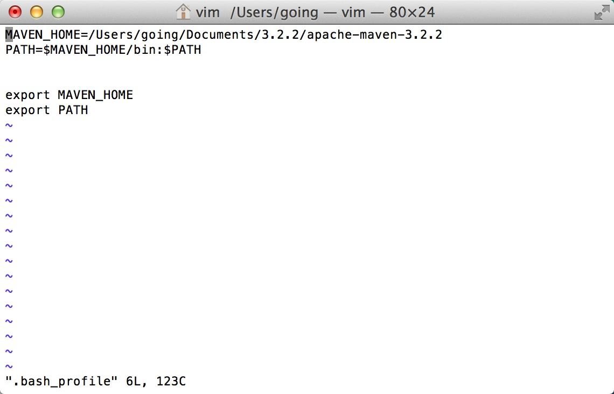
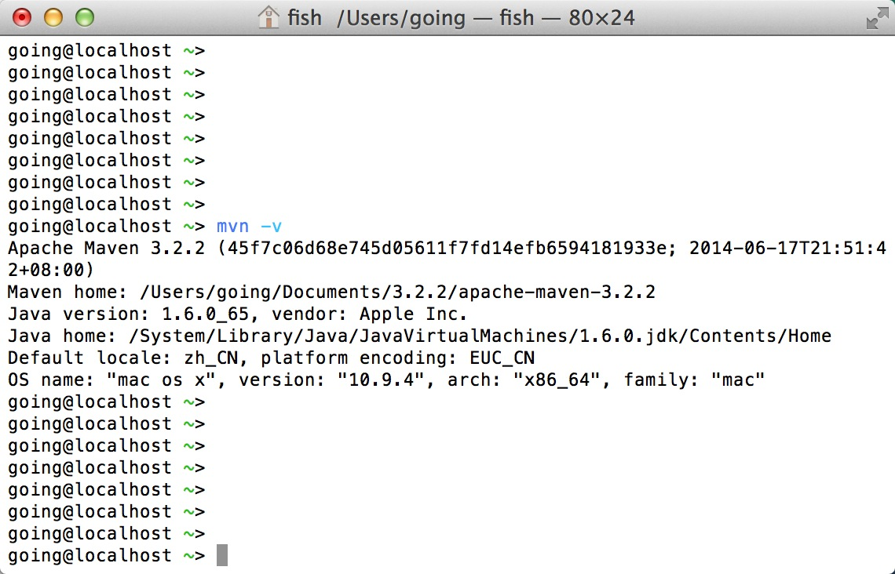
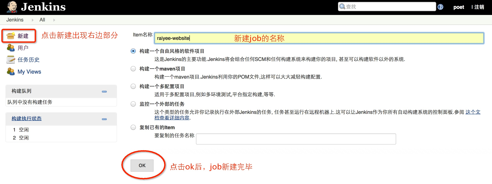
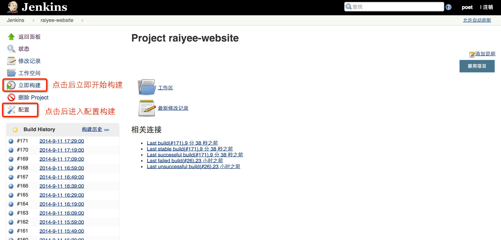
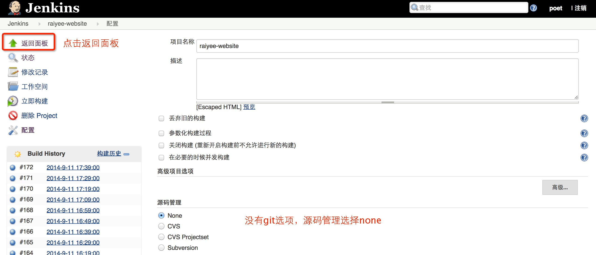
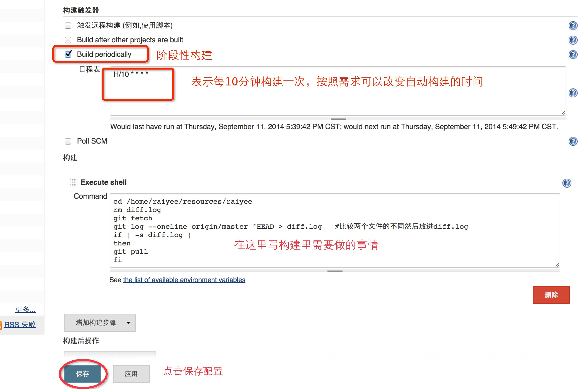
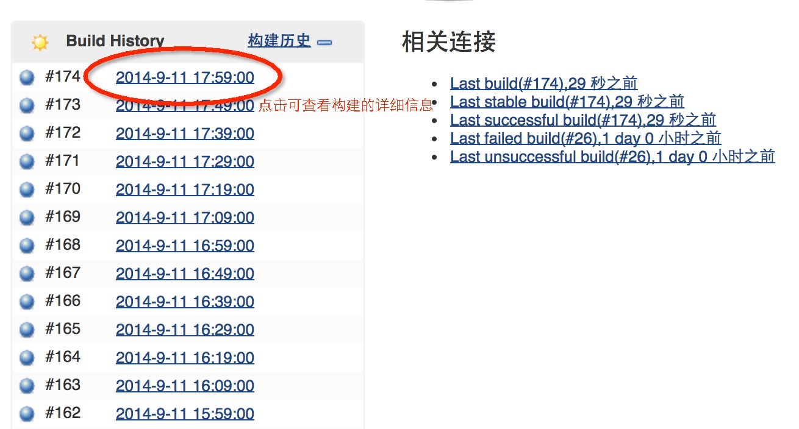

# 搭建CI框架

#### 持续集成的基本原则很简单：尽早集成，经常集成。有如下的几个基本特点：
- **持续集成**：是软件工程发展中保证迭代化开发质量的主要方式，通过持续集成可以利用自动化的方式来尽量自动地、尽早保证代码质量。

- **持续自动构建** ：使用CI，你只要按一下按钮，它会依照预先制定的时间表，或者响应某一特定事件，就开始进行一次构建过程。

- **持续自动检查** ：CI系统能够设定成持续地对新增或修改后签入的源代码执行构建，也就是说，当软件开发团队需要周期性的检查新增或修改后的代码时，CI系统会不断要求确认这些新代码是否破坏了原有软件的成功构建。这减少了开发者们在手动检查彼此相互依存的代码中变化情况需要花费的时间和精力

- **持续自动测试** ：这个是构建检查的扩展部分，这个过程将确保当新增或修改代码时不会导致预先制定的一套测试方案在构建构件后失败。构建测试和构建检查一样，失败都会触发通知(Email,RSS等等)给相关的当事人，告知对方一次构建或者一些测试失败了

-  **持续部署** ：一旦自动化检查和测试的构建已经完成，一个软件构件的构建周期中可能也需要一些额外的任务，诸如生成文档、打包软件、部署构件到一个运行环境或者软件仓库。只有这样，构件才能更迅速地提供给用户使用。
    
>知道更多请点击[持续集成](http://baike.baidu.com/view/5253255.htm?fr=aladdin)

------------------

### 需要的软件

- jdk
- tomcat
- jenkins了解更多请点击[here](http://blog.csdn.net/onlyqi/article/details/7076915)and[here](http://baike.baidu.com/view/6190216.htm?fr=aladdin)
- git
- maven

-------------------
Jenkins，之前叫做Hudson，是基于Java开发的一种 持续集成工具，用于监控秩序重复的工作，包括：

1、持续的软件版本发布/测试项目。

2、监控外部调用执行的工作。 

#### jenkins的搭建
jenkins.war 下载完毕后放入tomcat的webapp目录下，如图：

启动tomcat，jenkins就会启动了，启动jenkins时，会自动在webapps目录下建立jenkins目录。

----------

maven 下载安装后，需要配置环境变量，echo用来查看环境变量，在.bash frofile配置 基本配置：
vim .bash_profile 进入vi编辑器，按i键进入编辑模式，配置环境变量：
MAVEN_HOME=/Users/going/Documents/apache-maven-3.1.1  
PATH=$PATH:$MAVEN_HOME/bin

export MAVEN_HOME  
export PATH
如图：

#### ls -al查看所有文件的详细信息
#### export: 使变量的值对当前shell的所有子进程都可见
#### source .bash_profile  命令通常用于重新执行刚修改的初始化文件
#### mvn -v 显示版本号，验证配置成功,如图：

-----------------------------

#### 下面以raiyee网站为例，介绍jenkins的具体使用方法：
首先启动服务器上的tomcat，输入http://182.92.180.77:8080/jenkins/进入到jenkins界面
如图：

**登录后点击新建，创建project如图：**

**在Item名称填写project的名称，点选构建一个自由风格的软件项目，点击ok创建成功
如图：**

**点击raiyee-website后，进入如图所示的界面：**

**再点击配置**

command中用命令写构建要做的内容，以raiyee-website为例：
这次构建，要先判断和最新一次pull的内容有无变化，如果有才会执行git pull命令。其中diff.log是自己建的一个文件，用来放pull的project与最新一次pull下来的差别的。

**其中**

H/10 ＊＊＊＊表示每10分钟会触发一次构建，触发时间可以根据需要调整，不过最少好像要间隔2分钟（相关语句网上查找）
写好构建内容后，保存，然后立即构建。会在左边出现构建历史，如图：

**点击****可以查看详细信息。**
**点击****我们就能看到控制台的输出**

**出现Finished: SUCCESS表明本次构建成功**