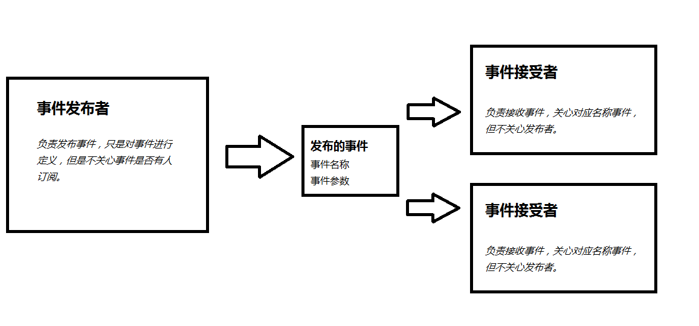

# jquery插件pubsub介绍和demo

jquery的pubsub插件是一个基于事件订阅发布的插件，其主要用途在于同页面不同模块之间，相互调用时可以做到基于事件调用，
充分解耦。

[官方主页](https://github.com/cowboy/jquery-tiny-pubsub)

[下载链接](https://codeload.github.com/Digitalxero/jquery-pubsub/legacy.zip/1.1.0)

## 简单说明 ：


发布者 ： 负责发布一个事件，对该事件进行定义，定义事件的名称以及传递的参数。
接收者 ： 初始化时订阅事件(通过事件的名称)，设定回调方法，当捕获到对应事件触发的时候，调用回调方法，并且调用参数。

## 代码示例 ：
### 简单的发布者和接收者
```html
<html>
<head>
<title>Welcome to nginx!</title>
<meta http-equiv="content-type" content="text/html; charset=UTF-8"/>
<!-- jquery必须要引入 -->
<script src="jquery-1.11.1.min.js" type="text/javascript"></script>
<!-- 引入pubsub类库 -->
<script src="jquery.pubsub.js" type="text/javascript"></script>


<script type="text/javascript">
	// 定义函数，并且使用subscribe方法将这个函数绑定一个topic(事件名称)，
    // 该函数就是此事件的回调函数
    var foo = function(a, b){
        alert(a+b);
    }
    $.subscribe("/component1/topic1", foo);
	
    // 订阅同样topic，并定义一个匿名函数
    $.subscribe("/component1/topic1", function(a,b) {
        alert(a-b);
    });
	
    // 发布一个事件，包含topic已经事件的参数。
    $.publish("/component1/topic1", [1,2]);
</script>
</head>
<body>
</body>
</html>
```

## 语法说明

1. 订阅事件
` $.subscribe(topic. function)`
$.subscribe为订阅函数，参数topic 表示订阅的事件名称，function 表示回调的方法。


2. 发布事件
`$.publish(topic, [param, params...]);`
$.publish是发布函数，参数topic 表示发布的事件名称，params是参数列表。


## 说明
使用该插件，开发人员则可分模块进行各自开发，当模块与模块之间有交互时。开发人员之间只需约定好对应的topic以及
所传参数即可，不必关心对方的方法实现。
同时，一个事件可以被多个订阅者所订阅，发布后根据订阅顺序依次响应。

## 事件订阅发布代码例子下载
[jquery-pubsub-demo](https://github.com/statickid/technique-sharing/tree/master/makedown/jquery-pubsub学习记录/code-file)